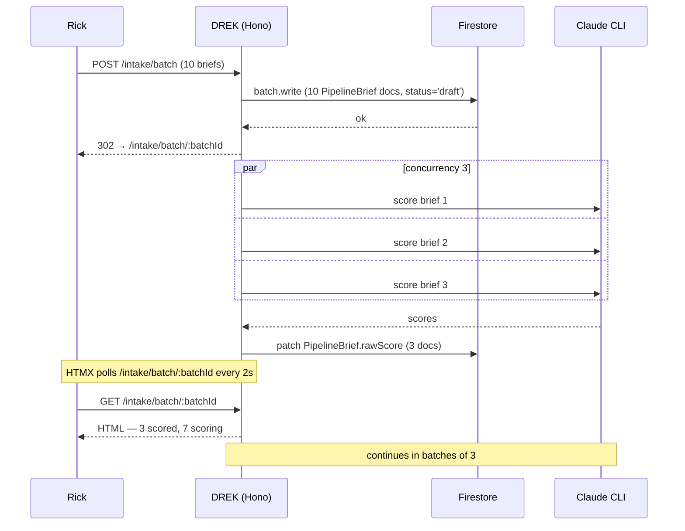
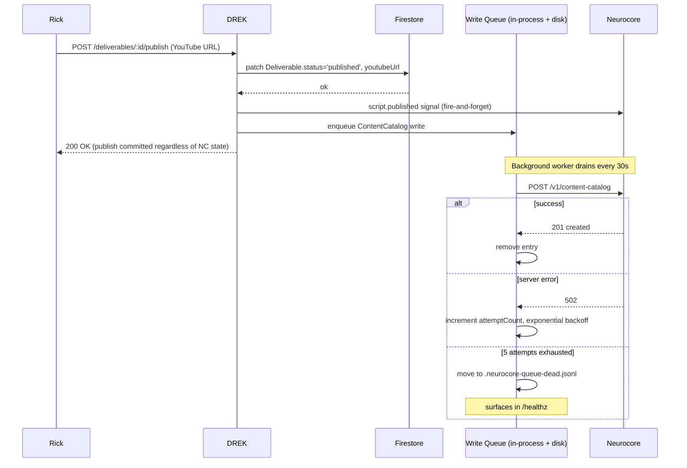
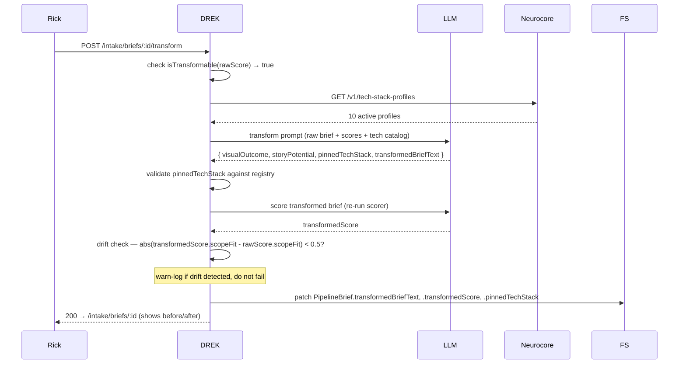

# TECH-SPEC — DREK v2.1: Content Substrate

**Date:** 2026-05-19
**Version target:** `v2.1.0`
**Author:** Tony Stark (lead dev) — reviewed by Lisa (coordination)
**Status:** Draft — pending Lisa's review before build starts
**Companion docs:** [`PRD-drek-v2-youtube-2026-05-18.md`](./PRD-drek-v2-youtube-2026-05-18.md), [`TECH-SPEC-drek-v2-youtube-2026-05-18.md`](./TECH-SPEC-drek-v2-youtube-2026-05-18.md), [`CHANGELOG.md`](./CHANGELOG.md)

---

## 1. Summary

v2.0 shipped the YouTube Channel Operating System inside DREK. Rick has now run it against real Upwork briefs and found two friction points and one missing capability:

1. **Friction — single-brief intake.** Rick pastes 5-10 briefs at a time but the form only accepts one. Each is a full round-trip.
2. **Friction — low brief scores.** ~80% of real Upwork briefs score sub-3.5, because freelance briefs are written for engineers, not for cameras. Most have latent video story potential but no narrative scaffolding.
3. **Missing — cross-app content reuse.** Once Rick publishes a video, no other app in the ecosystem (Nami's outreach, the website, lead qualification) can see what he's published, on what stack, with what performance.

v2.1 ships three coupled features that solve all three:

- **Batch intake** — multi-row form, N briefs at once, parallel scoring.
- **Brief Transformer (Call 11.5)** — turns a high-base brief (3.0+) into a 5.0-grade brief by extracting the latent narrative and pinning a specific tech stack.
- **Cross-app content substrate in Neurocore** — three new shared entities (`ContentCatalog`, `TechStackProfile`, `StackPerformance`) so every app reads from the same canonical source.

YouTube Analytics ingestion is partially in scope — the client module ships, but the analytics-driven coverage rotation in the transformer waits until Rick's OAuth provisioning lands.

---

## 2. Goals and Non-Goals

### Goals

- G1: Rick can paste 5+ briefs at once and have them all scored in parallel (~30-45s total for 10 briefs).
- G2: Briefs scoring 3.0+ composite with the right axis shape can be auto-transformed into 5.0-grade briefs ready for plan promotion.
- G3: Every published Deliverable produces a shared `ContentCatalog` record in Neurocore that other apps can query.
- G4: Tech stacks become a curated, cross-app shared entity (`TechStackProfile`) instead of a DREK-local TypeScript constant.
- G5: YouTube read-only API client ships; analytics-fed `StackPerformance` ships when Rick's OAuth creds are provisioned.
- G6: Architecture supports drift detection — if the transformer starts hallucinating, we can prove it.

### Non-Goals

- **NG1:** No auto-promote of transformed briefs to plans — Rick still clicks promote per brief.
- **NG2:** No coverage-driven tech-stack rotation in the transformer (gated on analytics data per Shikamaru).
- **NG3:** No image generation for thumbnails. Same scope as v2.0.
- **NG4:** No YouTube write actions (uploading, editing metadata). Read-only.
- **NG5:** No automatic OAuth UI in DREK. Token bootstrapping is a one-time CLI script Rick runs locally.

---

## 3. Architecture Overview

```
┌─────────────────────────────────────────────────────────────────────────┐
│ DREK (drek)                                                             │
│                                                                         │
│ ┌──────────────┐  ┌──────────────────┐  ┌──────────────────────────┐   │
│ │ Batch intake │  │ Brief Transformer│  │ YouTube client (RO)      │   │
│ │ form + route │  │ engine (Call 11.5)│ │ — analytics + channel   │   │
│ └──────┬───────┘  └────────┬──────────┘  └──────────┬───────────────┘   │
│        │                   │                        │                   │
│        ▼                   ▼                        │                   │
│   PipelineBrief       PipelineBrief                 │                   │
│   (rawScore +         (transformedScore +           │                   │
│    batchId)            pinnedTechStack)             │                   │
│                                                     │                   │
│   ┌────────────────────────────────────────────────┼───────────────┐   │
│   │  Neurocore client (read-write — UPGRADED)      │               │   │
│   │  + retry queue for ContentCatalog writes       │               │   │
│   └────────────────────────────┬───────────────────┴───────────────┘   │
└────────────────────────────────┼────────────────────────────────────────┘
                                 │
                                 ▼
┌─────────────────────────────────────────────────────────────────────────┐
│ Neurocore (lezzur/neurocore)                                            │
│                                                                         │
│  ContentCatalog       TechStackProfile      StackPerformance            │
│  (1 doc per           (curated registry,    (analytics-derived,         │
│   published           seeded at deploy)     populated from              │
│   deliverable)                              YouTube data)               │
│                                                                         │
│  + AudienceProfile (existing v2.0)                                      │
└─────────────────────────────────────────────────────────────────────────┘
```

**Component changes from v2.0:**

- Neurocore client `client.ts` upgraded from **read-only to read-write**.
- New retry queue lives in DREK at `src/neurocore/write-queue.ts` — in-process FIFO with on-disk persistence so a service restart doesn't lose pending writes.
- Format-profile and audience-profile composition is unchanged — `buildSystemPrompt()` works identically for the new Call 11.5.

---

## 4. The Six Pieces

### Piece 1 — Batch Intake

**Goal:** Multi-row form, parallel LLM scoring, persist-first semantics.

**Backend:**

- New route: `POST /intake/batch` — accepts `{ briefs: [{ title, sourceUrl, briefText }, ...] }` (Zod-validated, max 25 briefs per submit).
- In one Firestore batch, write N `PipelineBrief` docs with `status: 'draft'` and a shared `batchId`.
- Kick off scoring async: `Promise.all` over chunks of 3 calls to the existing `scoreBrief()` engine step. Per-brief failure → row status = `scoring_failed`, batch continues.
- Redirect to `/intake/batch/:batchId`.

**Frontend:**

- New page: `/intake/batch/new` — renders 3 brief-row groups by default, each with the existing `(title, sourceUrl, briefText)` fields. "+ Add another brief" button appends; `×` removes a row.
- "Score all" button submits the whole form.
- Batch view at `/intake/batch/:batchId` — one row per brief showing live status (`scoring`/`scored`/`scoring_failed`/`promoted`/`dismissed`) + composite score + axis breakdown. HTMX polls every 2s while any row is `scoring`. Each row links to the existing `/intake/briefs/:id` detail page.

**Schema delta:**

```typescript
// PipelineBrief schema gets one additive field
batchId: z.string().nullable().default(null),
```

Plus a new `briefBatchSchema` for grouping (no separate Firestore collection — just a query helper `listBriefsByBatchId(batchId)`).

**No auto-promote.** Confirmed today — promotion stays per-row, manual click.

### Piece 2 — Brief Transformer (Call 11.5)

**Goal:** Turn 3.0+ briefs with weak narrative axes into 5.0-grade briefs ready for plan promotion.

**Trigger:** From the brief detail page, "Transform" button visible only when the brief is **transformable** (see gate below).

**Transformability gate:**

```typescript
function isTransformable(score: BriefScore): boolean {
  return (
    score.scopeFit >= 3.5 &&
    score.audienceMatch >= 3.5 &&
    (score.visualOutcome < 3.0 || score.storyPotential < 3.0)
  );
}
```

The per-axis shape IS the gate — no composite floor. The ideal transformer candidate is exactly the high-technical / weak-narrative profile, which often has a low composite (e.g. 2.75) precisely because the narrative axes are weak. Composite-floor gating would reject the best candidates.

A brief at `{scopeFit: 2, audienceMatch: 2, visualOutcome: 3, storyPotential: 3}` hits 2.5 composite — **not transformable**, the project itself is wrong-for-channel (technical axes too weak). A brief at `{scopeFit: 4, audienceMatch: 4, visualOutcome: 1.5, storyPotential: 1.5}` hits 2.75 composite — **transformable**, latent narrative exists despite the low aggregate.

**Engine step:** `src/engine/transform-brief.ts` — Call 11.5 in the pipeline.

**Input:** raw brief + raw `BriefScore` + the `TechStackProfile` catalog from Neurocore + an empty-for-now channel coverage block.

**Output (Zod-validated):**

```typescript
{
  visualOutcome: string;       // generated only if rawScore.visualOutcome < 3.0
  storyPotential: string;      // generated only if rawScore.storyPotential < 3.0
  pinnedTechStack: {
    primary: string;           // MUST be in TechStackProfile registry
    supporting: string[];      // 0-4 strings, MUST all be in registry
    rationale: string;         // 1-3 sentences
  };
  transformedBriefText: string;  // the full reassembled brief — original scopeFit/audienceMatch text preserved
}
```

**Validation:**

- `pinnedTechStack.primary` and every `supporting` entry must exist in the `TechStackProfile` registry. LLM hallucinations rejected.
- Untouched original-brief content for the scopeFit/audienceMatch axes (we score the transformed brief on all 4 axes and the system warns if scopeFit or audienceMatch deltas exceed ±0.5 — that's the drift signal L flagged).

**Persistence — drift-detection-ready (L's input):**

The existing `PipelineBrief.score` field (from v2.0 Call 11) is preserved unchanged — it becomes the pre-transform / raw score. Three additive fields are appended:

```typescript
// Existing v2.0 field, unchanged — this is the pre-transform score:
score: BriefScore | null,

// NEW in v2.1 — all default to null:
transformedBriefText: string | null,
transformedScore: BriefScore | null,     // re-scored after transformation
pinnedTechStack: PinnedTechStack | null,
```

No rename, no migration. Re-score after transform writes `transformedScore` alongside the untouched `score`. The full `{before: score, after: transformedScore}` per-axis delta is reconstructable for the drift report. Day-50 drift query is one Firestore scan.

**Coverage rotation: DEFERRED.** Per Shikamaru's "rotation rule should be gated on having data" point. The transformer prompt today contains `CHANNEL COVERAGE: (no data yet — pick the best technical fit)`. When `StackPerformance` lands (piece 6), the coverage block fills in.

**Retry policy:** Same as every other v2 engine step — retry-once on bad JSON or validation failure (e.g. phantom tech stack), `PlanningEngineError(INVALID_OUTPUT)` after second failure. Brief stays in pre-transform state.

### Piece 3 — Neurocore ContentCatalog

**Goal:** One shared record per published Deliverable, queryable by every app in the ecosystem.

**Lives in:** `lezzur/neurocore` (not drek). DREK is the **writer**; other apps (Nami's outreach, website portfolio, lead qualification) are **readers**.

**Entity:**

```typescript
ContentCatalog {
  id: string;                    // 'content_<uuid>'
  deliverableId: string;         // FK to DREK's Deliverable.id
  planId: string;                // FK to DREK's Plan.id
  kind: 'long_form' | 'short_clip' | 'lead_magnet';
  title: string;
  youtubeUrl: string;
  youtubeVideoId: string;        // extracted from URL — 11-char id
  audienceProfileId: string;     // reference to existing AudienceProfile
  primaryTechStackId: string;    // reference to TechStackProfile.id
  supportingTechStackIds: string[];
  topicTags: string[];           // up to 10 — from PublishMetadata.tags
  publishedAt: ISO-timestamp;
  sourceApp: 'drek';             // future: could be other publishers
  createdAt: ISO-timestamp;
  updatedAt: ISO-timestamp;
}
```

**Indexes:**

- `(sourceApp, publishedAt DESC)` — recent activity feed
- `(primaryTechStackId, publishedAt DESC)` — "show me Rick's vapi videos"
- `(audienceProfileId, publishedAt DESC)` — "show me content for business owners"

**Neurocore endpoints:**

- `POST /v1/content-catalog` — create. Idempotency key on `deliverableId` so re-publish doesn't duplicate.
- `GET /v1/content-catalog/:id` — fetch one
- `GET /v1/content-catalog` — list with filters (`?primaryTechStackId=`, `?audienceProfileId=`, `?limit=20`)
- `PATCH /v1/content-catalog/:id` — for updating youtubeUrl if Rick republishes (rare)

**DREK integration:**

When the existing `script.published` signal fires (already in v2.0), DREK ALSO writes a `ContentCatalog` record to Neurocore. The two writes happen serially: signal first (analytics correlation), then `ContentCatalog` (cross-app discoverability). Both failures non-fatal to the local publish state transition.

**Failure semantics (Lisa's input):** Local publish never blocks on Neurocore write failure. But unlike the signal (which is fire-and-forget), `ContentCatalog` writes are queued and retried.

**Retry queue — `src/neurocore/write-queue.ts`:**

- In-memory FIFO of pending writes. Each entry: `{ url, body, idempotencyKey, attemptCount, queuedAt }`.
- Persisted to disk at `$WORKSPACE_ROOT/.neurocore-queue.jsonl` (append-only log) so a service restart doesn't lose writes.
- Worker drains the queue every 30s if non-empty, with exponential backoff per entry (max 5 attempts, then dead-letter to `.neurocore-queue-dead.jsonl`).
- Health check at `/healthz` surfaces queue depth and dead-letter count.

This is the **Neurocore client read-write upgrade** Lisa flagged. The existing `client.ts` gets:

- `createContentCatalog(payload): Promise<ContentCatalog>` — POST, idempotent
- `updateContentCatalog(id, patch): Promise<ContentCatalog>` — PATCH
- Both wired through the retry queue, not direct.

### Piece 4 — Neurocore TechStackProfile

**Goal:** Move the curated tech-stack registry out of DREK's local TypeScript constants and into Neurocore so every app reads from one source.

**Lives in:** `lezzur/neurocore`.

**Entity:**

```typescript
TechStackProfile {
  id: string;                    // 'tech_<kebab-slug>' (e.g., 'tech_vapi')
  name: string;                  // "Vapi", "Retell", "n8n", "Claude Code CLI"
  category: 'voice_bot' | 'workflow_automation' | 'agent_framework' |
            'database' | 'frontend' | 'devtool' | 'integration_platform';
  ecosystem: string[];           // ["twilio", "openai-realtime"]
  popularityTier: 'mainstream' | 'emerging' | 'niche';
                                 // mainstream = high search demand,
                                 // niche = small but engaged audience
  filmableNotes: string;         // 1-3 sentences: what's filmable about this stack
  exampleUseCases: string[];     // 2-5 example briefs this stack fits
  status: 'active' | 'deprecated';
  createdAt: ISO-timestamp;
  updatedAt: ISO-timestamp;
}
```

**Seed list (v2.1.0 launch — 10 entries):**

- `tech_vapi`, `tech_retell` (voice bots)
- `tech_n8n`, `tech_zapier`, `tech_make` (workflow automation)
- `tech_claude_code_cli`, `tech_cursor` (devtools)
- `tech_supabase`, `tech_firebase` (backend)
- `tech_twilio` (integration platform)

Rick edits the seed list before deploy. Seed script: `lezzur/neurocore/scripts/seed-tech-stack-profiles.ts`.

**Endpoints:**

- `GET /v1/tech-stack-profiles` — list all active
- `GET /v1/tech-stack-profiles/:id` — fetch one
- `POST /v1/tech-stack-profiles` — create (admin-only; Rick adds new entries as he learns new stacks)
- `PATCH /v1/tech-stack-profiles/:id` — update (e.g. flip to deprecated)

**DREK integration:**

The Brief Transformer (piece 2) reads the registry to validate `pinnedTechStack` outputs. New module `src/neurocore/tech-stacks.ts` mirrors the existing `audience-profiles.ts` client — cached in-process with TTL, invalidated on any fetch failure. **`src/engine/tech-stacks.ts` (the local DREK constant) gets deleted in this milestone.**

### Piece 5 — YouTube Client (Read-Only)

**Goal:** Ship the YouTube API client module ahead of the analytics ingestion that needs it.

**Module:** `src/youtube/client.ts` — mirrors the existing `src/neurocore/client.ts` pattern.

**Auth:** OAuth 2.0 Desktop app type. Refresh token cached at `$WORKSPACE_ROOT/.youtube-token.json` (gitignored). Bootstrap script `scripts/bootstrap-youtube-oauth.ts` walks Rick through the loopback flow once; subsequent service restarts read the cached refresh token and get fresh access tokens automatically.

**Methods (v2.1.0):**

- `getChannelSummary(): Promise<ChannelSummary>` — subscriber count, total views, video count (Data API v3)
- `getVideoStats(videoIds: string[]): Promise<VideoStats[]>` — views, likes, comments per video (Data API v3, batched up to 50 ids per call)
- `getVideoAnalytics(videoId: string, dateRange: DateRange): Promise<VideoAnalytics>` — watch time, CTR, retention curve (Analytics API)

**Errors:**

```typescript
YouTubeError {
  code: 'NOT_CONFIGURED' | 'AUTH_FAILED' | 'QUOTA_EXCEEDED' |
        'NOT_FOUND' | 'UNREACHABLE' | 'TIMEOUT' | 'INVALID_RESPONSE';
  endpoint: string;
  detail?: unknown;
}
```

Same retry envelope as the Neurocore client (one retry on `UNREACHABLE`/`TIMEOUT`/server errors, no retry on quota/auth).

**Quota awareness:** Data API costs are tracked in-process via a simple counter — `getChannelSummary` = 1 unit, `getVideoStats` batch = 1 unit, `getVideoAnalytics` = ~5 units. Quota cap is 10K/day. The counter logs warn at 80% and refuses calls at 95% to leave headroom.

### Piece 6 — Neurocore StackPerformance + Analytics Ingestion + Coverage-Aware Picker

**Lives in:** `lezzur/neurocore` (entity + endpoints) + drek (ingestion cron + transformer integration).

**Blocked on:** Piece 5 + Rick's OAuth creds.

**Entity (in Neurocore):**

```typescript
StackPerformance {
  id: string;                    // 'perf_<techStackId>'
  techStackProfileId: string;    // FK
  videoCount: number;            // how many videos have used this stack
  avgViews: number;
  avgWatchTimeSeconds: number;
  avgCtr: number;                // percent, 0-100
  totalRevenueUsd: number | null; // null if monetary scope not granted
  lastVideoPublishedAt: ISO-timestamp | null;
  lastComputedAt: ISO-timestamp;
}
```

**Computation:**

- Nightly DREK cron at `src/cron/refresh-stack-performance.ts` (runs at 04:00 server time).
- For each `ContentCatalog` entry with a `youtubeVideoId`, calls `getVideoStats` + `getVideoAnalytics`.
- Aggregates by `primaryTechStackId` → upserts `StackPerformance`.
- Quota cost: ~6 units per video × ~50 videos = 300 units/night. Well inside the 10K/day cap.

**Endpoints:**

- `GET /v1/stack-performance` — list all
- `GET /v1/stack-performance/:techStackProfileId` — fetch one

**Coverage-aware transformer (the piece 2 deferred work):**

Once `StackPerformance` is populated, the Brief Transformer's prompt picks up a populated CHANNEL COVERAGE block:

```
CHANNEL HISTORY (inform, don't avoid):
  vapi: 3 videos, avg 12K views, 8.2% CTR — mainstream
  claude-code-cli: 7 videos, avg 28K views, 11% CTR — mainstream
  retell: 0 videos — emerging

TIE-BREAK RULE: When two stacks fit equally, prefer the one with
fewer videos UNLESS it's marked 'niche' — for niche stacks, always
weigh against view counts. Never penalize a mainstream stack for
being popular.
```

The tie-break rule encodes Rick's exact instruction from today: "it is ok to refeature popular stacks because that is what a larger number of people want to see."

---

## 5. Data Model Summary

### DREK additive schema fields (no migration — defaults are null/empty)

```typescript
// PipelineBrief — the existing v2.0 `score: BriefScore | null` field is
// unchanged and becomes the pre-transform / raw score. Four NEW fields:
batchId: string | null = null;
transformedBriefText: string | null = null;
transformedScore: BriefScore | null = null;
pinnedTechStack: {
  primary: string;
  supporting: string[];
  rationale: string;
} | null = null;
```

### Neurocore — three new collections

- `content_catalog`
- `tech_stack_profiles`
- `stack_performance`

All three are top-level collections, same pattern as the existing `audience_profiles`.

---

## 6. New Routes

### DREK

| Method | Path | Purpose |
|--------|------|---------|
| GET | `/intake/batch/new` | Multi-row intake form |
| POST | `/intake/batch` | Create N briefs, kick off async scoring |
| GET | `/intake/batch/:batchId` | Batch overview, HTMX-polled rows |
| POST | `/intake/briefs/:id/transform` | Fire Call 11.5 |
| GET | `/healthz` (extended) | Reports `neurocoreWriteQueueDepth` + `neurocoreDeadLetterCount` |

### Neurocore

| Method | Path | Purpose |
|--------|------|---------|
| POST | `/v1/content-catalog` | Idempotent create |
| GET | `/v1/content-catalog` | List with filters |
| GET | `/v1/content-catalog/:id` | Fetch one |
| PATCH | `/v1/content-catalog/:id` | Update |
| GET | `/v1/tech-stack-profiles` | List active |
| GET | `/v1/tech-stack-profiles/:id` | Fetch one |
| POST | `/v1/tech-stack-profiles` | Admin create |
| PATCH | `/v1/tech-stack-profiles/:id` | Admin update |
| GET | `/v1/stack-performance` | List all |
| GET | `/v1/stack-performance/:techStackProfileId` | Fetch one |

---

## 7. Sequence Diagrams

### 7.1 Batch intake + parallel scoring



### 7.2 Publish flow with ContentCatalog write + retry queue



### 7.3 Brief transform end-to-end



---

## 8. Security

- **OAuth tokens** — refresh token cached on disk only, never logged, gitignored. Bootstrap script writes with `0600` permissions on POSIX.
- **YouTube URL allowlist** — already enforced in v2.0 via `YOUTUBE_URL_REGEX`. Reused for the ContentCatalog write (the URL stored there is the same one).
- **Neurocore writes** — still bearer-token auth (existing pattern). Token never logged.
- **Tech-stack registry** — only `POST`/`PATCH` are admin-only on Neurocore. Reads are unrestricted (other apps need them).
- **Idempotency** — every Neurocore write carries an idempotency key (`drek-content-catalog-<deliverableId>`) so the retry queue can't create duplicates.

---

## 9. Performance Targets

| Operation | Target |
|---|---|
| Batch intake submit (10 briefs, all 4 axes scored) | < 60s end-to-end |
| Brief transform (Call 11.5 + rescore) | < 30s |
| `/intake/batch/:batchId` page load | < 500ms |
| Neurocore write queue drain cycle | < 5s per entry (single attempt) |
| Nightly `refresh-stack-performance` cron | < 2 min for 50 videos |

---

## 10. Monitoring

- `/healthz` extended with:
  - `neurocoreWriteQueueDepth: number`
  - `neurocoreDeadLetterCount: number`
  - `youtubeQuotaUsedToday: number`
  - `youtubeQuotaCap: number`
- Pino structured logs at `info` for queue drains, `warn` when queue depth > 10 or quota > 80%, `error` for dead-letter entries.
- One new admin route: `GET /admin/drift-report` — returns the post-transform drift distribution across all transformed briefs (L's drift-detection report).

---

## 11. Test Strategy

### Unit (vitest, ~80 new tests expected)

- `transform-brief.ts` — happy path, transformability gate, validation retry on phantom tech stack, drift detection trigger
- `tech-stacks.ts` (DREK client) — cache invalidation on fetch failure, network error handling
- `write-queue.ts` — enqueue, drain, exponential backoff, dead-letter promotion, disk persistence round-trip
- `youtube/client.ts` — quota counting, error mapping
- Batch intake route — validation, partial failure, concurrency limit
- Neurocore client `createContentCatalog` — idempotency, retry semantics

### Integration

- Extend `tests/integration/v2-full-pipeline.test.ts` with two new scenarios:
  - **Batch intake → transform → promote** — 5 briefs, 3 transformable, transform 2, promote 1
  - **Publish writes ContentCatalog** — mock Neurocore, assert queue drained, dead-letter on persistent failure

### Manual smoke

- Rick provisions YouTube creds → runs bootstrap script → `getChannelSummary` returns his actual subscriber count.

---

## 12. Migration / Rollout

Additive only. No data migrations.

**Deploy order (the order Lisa called out earlier):**

1. Neurocore side first — deploy `ContentCatalog` + `TechStackProfile` entities + endpoints + run the tech-stack seed script. (No effect on DREK until DREK deploys.)
2. DREK side — pull, build, restart. New routes available; existing flows unchanged.
3. Rick provisions YouTube OAuth, runs `bootstrap-youtube-oauth.ts` once. Cron stays dormant until creds exist.
4. After 7-14 days of v2.1 use with published Deliverables flowing into ContentCatalog, enable the nightly `refresh-stack-performance` cron. Coverage block in transformer fills in.

**Rollback:** All DREK changes reverse cleanly via `git revert`. Neurocore entities can stay (additive — they don't affect anything else). The retry queue's disk file is harmless if the service is downgraded — older code just won't read it.

---

## 13. Open Questions / Dependencies

| Item | Owner | Status |
|---|---|---|
| Seed list of 10 tech stacks — does Rick want to edit before launch? | Rick | needs confirmation |
| YouTube OAuth provisioning | Rick | in progress |
| Drift threshold tuning — `±0.5` chosen, but the right number emerges from real data | Tony (post-launch) | revisit at day 50 |
| Should YouTube quota counter persist across service restarts, or reset on boot? | Tony | leaning reset-on-boot; if Rick exceeds 10K/day quota that's a real problem, not a counter issue |
| Are non-DREK apps ready to consume ContentCatalog reads in v2.1.0, or is this just publishing for future consumers? | Lisa | **Resolved 2026-05-19**: No consumers ready in v2.1.0. DREK writes for future readers. Design the API as if consumers exist today so the contract doesn't churn when they arrive. |

---

## 14. Milestones

Sized for one-commit-each, ship-as-you-go.

| ID | Scope | Dependencies | Est |
|---|---|---|---|
| **M25** | Batch intake (route + view + tests). Persist-first, concurrency 3, HTMX poll. | none | ~3 hr |
| **M26** | Neurocore TechStackProfile entity + endpoints + seed script. | none | ~2 hr |
| **M27** | Neurocore ContentCatalog entity + endpoints. | none | ~2 hr |
| **M28** | DREK Neurocore client read-write upgrade + write queue + ContentCatalog write on publish + drek-side tech-stacks reader (delete local constant). | M26, M27 | ~4 hr |
| **M29** | Brief Transformer (Call 11.5) — engine + view + transformability gate + drift-check store. | M28 (transitively M26) | ~4 hr |
| **M30** | YouTube client read-only + bootstrap-oauth script + quota tracking. | none | ~3 hr |
| **M31** | Neurocore StackPerformance entity + nightly refresh cron + transformer prompt fills in coverage block. | M28, M30, Rick's OAuth | ~3 hr |
| **M32** | Docs (README, CHANGELOG, CLAUDE.md) + v2.1.0 tag. | all | ~1 hr |

**Total:** ~22 hours of focused work. Shippable in 2-3 working sessions.

---

## 15. References

- v2.0 PRD — `PRD-drek-v2-youtube-2026-05-18.md`
- v2.0 Tech Spec — `TECH-SPEC-drek-v2-youtube-2026-05-18.md`
- Conversation transcript that produced this spec — 2026-05-19 Macross discussion (this file folds in inputs from Lisa, L Lawliet, Shikamaru, and Rick across that session)
